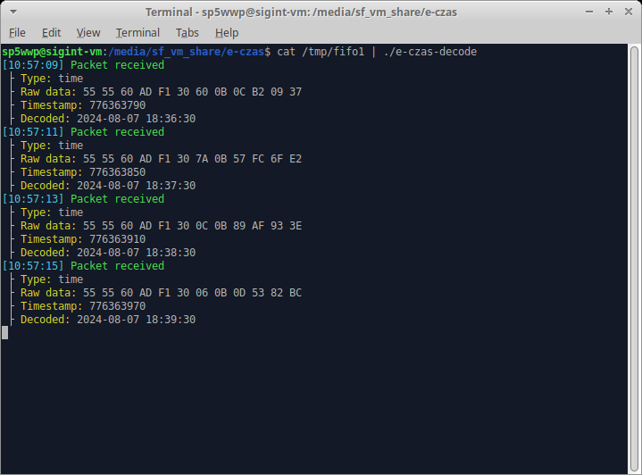

# e-Czas
e-Czas C decoder.

## Building
Build process is standard - just run `make` in the main directory.

## GNU Radio flowgraph usage
Connect your single-sideband radio receiver tuned to 224 kHz (USB) to the line input.
Make sure that the peak-to-peak value of the output from the first `AGC2` block is constant at around 2.0.
There should be little to no residual amplitude modulation at this point.

The flowgraph uses a named fifo located at `/tmp/fifo1`, create it before executing the .grc with `mkfifo /tmp/fifo1`.

After starting the flowgraph, run
```bash
cat /tmp/fifo1 | ./e-czas-decoder
```

## Decoder preview

