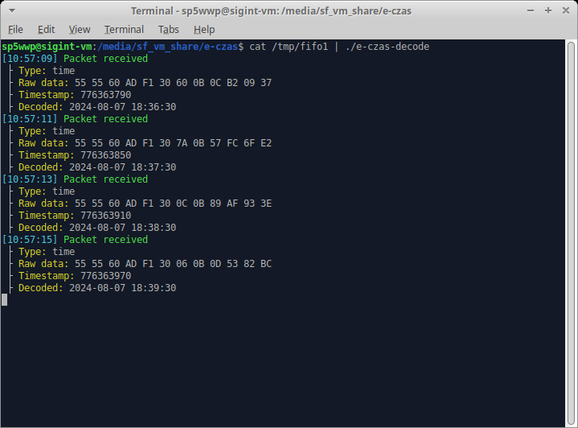

# e-Czas
e-Czas (PCSK225) decoder written in C.

## Frame structure
The incoming frequency-demodulated signal samples (as `S16_LE`) are fed into a circular buffer (10 samples per symbol, that is 500 samples per second). One symbol carries exactly one bit of information. Once the synchronization word is detected, the remaining frame symbols are extracted from the buffer and sliced.

The detected frame contains 96 bits of data:
- 16-bit synchronization word (`0x5555`)
- 8-bit header (`0x60` for the time packet)
- 3-bit time marker (`0b101`)
- 30-bit timestamp (e-Czas epoch, elapsed seconds starting Jan 1, 2000)
- 7-bit additional field containing timezone data, leap second announcement, DST switch, etc.
- 24-bit Reed-Solomon redundancy bits
- 8-bit CRC value calculated for the raw 5-byte payload, starting at the 4th byte

## Decoder path
The decoder first runs a data integrity check against the rececived data using the CRC field. If the received frame passes the check, packet contents are considered valid and the `pcsk_packet_t` struct is filled. In other case, the data is passed to a Reed-Solomon decoder and after a plausible decode (i.e. if a potentially valid codeword is found) a final CRC check is performed. If the CRC is valid, the struct is filled with corrected data, otherwise the packet data is discarded.

Since the PCSK225 signal's packet structure has major design flaws, Reed-Solomon codes are rendered virtually useless. This could have been avoided if the CRC value was covered by the error-correcting code.

## Building
Run `make` in the main directory.

## GNU Radio flowgraph usage
Connect your single-sideband radio receiver tuned to 224 kHz (USB) to the line input.
Make sure that the peak-to-peak value of the output from the first `AGC2` block is constant at around 2.0.
There should be little to no residual amplitude modulation at this point.

The flowgraph uses a named fifo located at `/tmp/fifo1`, create it before executing the .grc with `mkfifo /tmp/fifo1`.

After starting the flowgraph, run
```bash
./e-czas-decoder < /tmp/fifo1
```

## Decoder preview
The screenshot below shows Reed-Solomon codewords being printed out. That piece of code has been commented out due to structural changes in the decoder.

