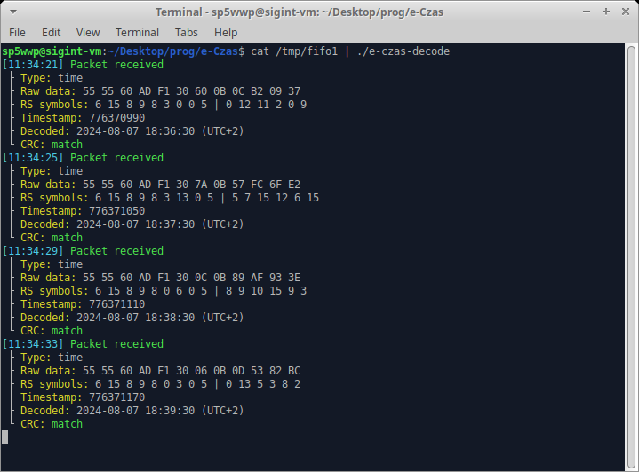

# e-Czas
e-Czas C decoder.

## GNU Radio file usage
Connect your single-sideband radio receiver tuned to 224 kHz (USB) to the line input.
Make sure that the peak-to-peak value of the output from the first `AGC2` block is constant at around 2.0.
There should be little to no residual amplitude modulation at this point.

## Decoder preview

